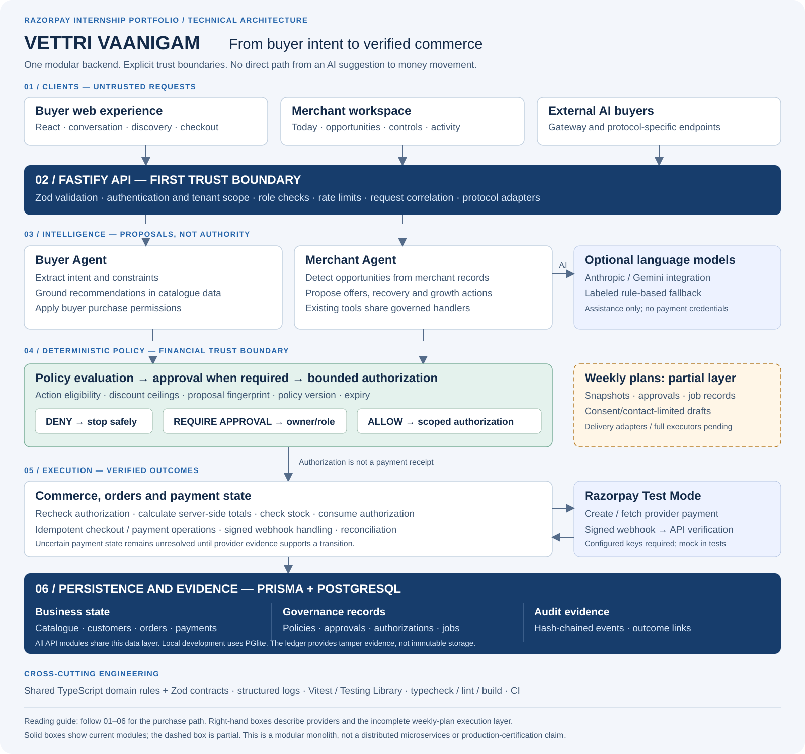

# VETTRI VAANIGAM architecture

[Full-resolution PNG](images/architecture-detailed.png) · [Simplified overview](images/architecture.svg)

## How to explain this diagram in an interview

“VETTRI VAANIGAM separates intelligence from authority. The buyer and merchant agents can suggest actions, but deterministic backend policies decide whether an action is permitted. Approved actions receive bounded authorization; commerce services still validate and execute the transaction. A payment is only reported as successful when provider evidence supports it. Every stage stores its own records so we can distinguish a recommendation, an approval, an execution, and an actual payment.”

### 01 — Three entry points, one commerce platform

The buyer interface handles shopping intent. The merchant interface handles business controls and decisions. External agents use gateway and protocol-specific routes. They have different access paths; the diagram does not imply that external agents share a merchant login or identical authentication mechanisms.

### 02 — Validate before interpreting or acting

The API establishes request scope and validates data before domain services handle it. Authentication, role checks, tenant isolation, and rate limits protect different boundaries: a valid request is not automatically authorized, and an authenticated user is not automatically an owner.

### 03 — Agents assist, but do not own financial truth

The buyer side extracts requirements and grounds recommendations in catalogue records. The merchant side detects opportunities and proposes governed actions. Optional model integrations support language tasks; deterministic fallback behavior permits an offline demonstration. Price calculations, approval rights, and payment outcomes are not free-form model decisions.

The optional-provider arrow is a logical integration edge, not a claim that every merchant task calls a model. Shared AI capabilities can be used by relevant services; the diagram omits individual module-to-provider calls for readability.

### 04 — The important boundary: suggestion to permission

A proposal can be denied, require approval, or qualify for bounded authorization. Approval applies to a specific proposal and policy context, not any future action the agent chooses. Fingerprints, policy versions, and expiry checks help detect changed or stale authorization context. A required approval is not silently treated as an automatic allow.

### 05 — Permission is checked again at execution

Commerce prepares the transaction using server-side values and the relevant authorization. Duplicate requests are handled through idempotency and state checks. The payment adapter communicates with Razorpay, while webhook verification and reconciliation determine which state transitions are supported by evidence.

The two provider arrows mean outbound provider requests and inbound verified evidence. They do not mean the browser or model may directly update the order to paid. The normal browser checkout interaction is omitted from the component view; provider credentials stay on the server.

### 06 — Persist facts and retain their provenance

Business, governance, and audit records share PostgreSQL through Prisma. This is one data layer, shown in three logical groups rather than three separate databases. The ledger makes decision history inspectable and tamper-evident, but database access controls and backups remain necessary.

### Why the unfinished layer is visible

Weekly-plan approvals and outbound drafts exist, but delivery-provider integrations and the complete execution/recovery layer do not. The dashed box prevents a reviewer from mistaking a designed extension for a finished system. It is separate from the existing governed-action handlers, which have their own working paths.

## Request path

1. A buyer uses the React shopping interface, or an external agent calls the gateway/protocol endpoints. Merchants manage their catalogue, controls, and approvals in the merchant interface.
2. The Fastify API validates requests, applies the appropriate authentication, tenant and role checks, and routes requests to domain services.
3. Buyer services extract intent and select catalogue candidates. Optional model providers assist with language tasks; a deterministic fallback supports offline evaluation.
4. Merchant services detect opportunities and propose actions. Policies, approval records, and bounded execution authorizations constrain eligible actions.
5. Commerce services calculate checkout values and manage order/payment state. Razorpay integration receives server-side requests and signed webhooks. Provider verification and reconciliation determine payment outcomes.
6. Prisma stores business state and audit events in PostgreSQL. Local PGlite is a development substitute, not a hosted production database.

## Trust boundaries

- Browser and external-agent input is untrusted. Client-supplied success flags cannot establish payment success.
- AI output is a proposal, not authority to spend, change prices, or bypass merchant policy.
- Merchant roles and tenant scope are enforced at API boundaries. New operational tables also enable row-level security without client-facing permissive policies.
- Razorpay webhook signatures are checked against raw request bytes. Amount, currency, provider identity, and transaction state remain relevant to acceptance.
- Idempotency and authorization consumption protect financial transitions from duplicate requests. They do not imply exactly-once delivery across every external service.
- The audit ledger is application-level tamper evidence. Protecting the database and retained personal information remains necessary.

## Weekly growth plans: current boundary

The weekly-plan routes persist proposals, owner approvals, jobs, and consent-checked outbound drafts. Draft creation checks the plan contact allowance, daily limits, per-customer frequency, and cooldown, using serializable transactions for contact reservations.

The route-driven preparation path respects retry timing, but a full production worker with lease recovery and verified provider delivery is not complete. Unsupported action executors are blocked. The dashed box in the diagram is deliberately marked unfinished; it must not be interpreted as an operational notification service.

## Code map

- Application wiring: `apps/api/src/app.ts`
- Buyer assistance: `apps/api/src/modules/buyer-agent/`
- Opportunity evidence: `apps/api/src/modules/growth/`
- Merchant agent: `apps/api/src/modules/merchant-agent/`
- Policy and approvals: `apps/api/src/modules/policy/`
- Checkout and orders: `apps/api/src/modules/commerce/`
- Payment verification: `apps/api/src/modules/payments/`
- Agent integrations: `apps/api/src/modules/gateway/`, `acp/`, and `x402/`
- Weekly plans: `apps/api/src/modules/growth-plans/`
- Persistence: `apps/api/prisma/schema.prisma` and `apps/api/prisma/migrations/`
- Shared rules and validation: `packages/domain/` and `packages/contracts/`

## Architectural trade-offs

The backend is a modular monolith: modules share one database and deployment. This keeps transaction boundaries and local evaluation straightforward. The design does not claim independent microservices, a distributed message broker, production scale measurements, or certified compatibility with every buyer-agent protocol.
