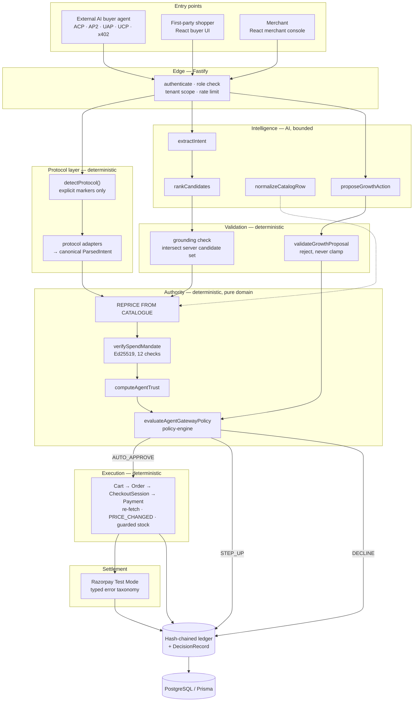
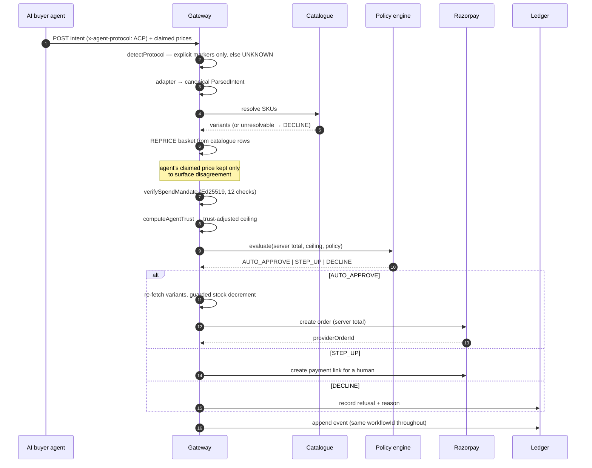
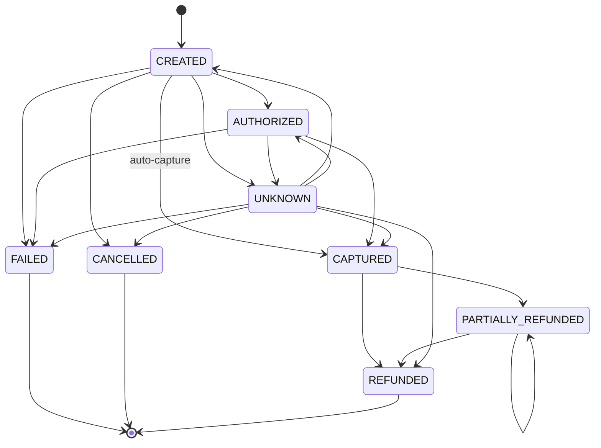

# VETTRI VAANIGAM — architecture


[Scalable SVG](images/architecture-detailed.svg) · [Simplified overview](images/architecture.png) · [Five-minute demo](DEMO.md) · [Problems log](TRACK01_PROBLEMS_LOG.md)

---

## The thesis

Every agentic commerce protocol — ACP, AP2, UAP, UCP, x402 — **states a price on the wire**. A merchant who believes that number has handed pricing authority to a stranger's language model.

Vettri Vaanigam is the gate that doesn't believe it. One endpoint that any AI buyer agent can reach in any of those dialects, which re-prices the basket from the merchant's own catalogue, verifies a signed spend mandate, scores the agent against its own history, and answers `AUTO_APPROVE` / `STEP_UP` / `DECLINE` — writing a plain-English decision record on every path, including the requests it could not parse.

**The model proposes. Deterministic code prices, authorizes and executes. Razorpay decides whether money actually moved.**

---

## Five invariants

Everything below is a consequence of these. If you only read one section, read this one.

| # | Invariant | Enforced at | Violated by |
|---|---|---|---|
| **I1** | A price is never accepted from a caller. Every amount is computed from catalogue rows. | `gateway/service.ts`, `purchase-proposal-service.ts` | nothing — there is no code path that accepts a caller's price as authoritative |
| **I2** | Model output is untrusted until a deterministic validator accepts it, and validators **reject rather than clamp**. | `growth-proposal-validation.ts`, `intent-extraction.ts`, `recommendation-grounding.ts` | nothing |
| **I3** | Authorization, execution and payment are three separate records, each re-validated at its own moment. | `policy/`, `commerce/`, `payments/` | nothing |
| **I4** | Payment success requires provider evidence. A client may never assert it. | `payment-transition.ts`, `razorpay-signature.ts` | nothing |
| **I5** | Every decision — including every refusal — is appended to a per-workflow hash chain by exactly one writer. | `audit/ledger.ts` | nothing; `prisma.agentAction.create` is never called directly |

**I1 is the load-bearing wall.** Without it, none of the others matter: an attacker who names their own price does not need to defeat policy, because policy is evaluating a number they chose.

---

## Layer map



**Read the diagram this way:** every arrow that touches money is inside a deterministic box. The AI boxes feed *into* validation, never *past* it.

---

## The request path an external agent actually takes

Order of operations is the design. Each step can only run because the previous one succeeded.



**Note step 6.** Repricing happens *before* mandate verification and *before* policy. That ordering is deliberate: the mandate's amount ceiling and the policy's ceiling must both be evaluated against **our** number, never the caller's. Verifying a mandate against a price the caller supplied would make the signature meaningless.

---

## Component responsibilities

| Component | Input | Output | AI? | Why this choice |
|---|---|---|---|---|
| `detectProtocol` | headers + body shape | protocol or `UNKNOWN` | No | Explicit markers only. A wrong guess hands amounts to a parser that will misread them, so an unrecognised request is refused rather than guessed |
| protocol adapters | wire payload | `ParsedIntent` | No | Everything downstream is protocol-blind. Adding a protocol is one adapter, not a new pipeline |
| repricing | SKUs + quantities | authoritative total | No | **I1** |
| `verifySpendMandate` | mandate + context | valid / coded refusal | No | Cryptography, not judgment |
| `computeAgentTrust` | counts from existing DecisionRecords | score + band | No | Pure arithmetic. No new write path — a derived view over records already being written |
| `evaluateAgentGatewayPolicy` | server total, ceiling, config | decision + reason + explanation | No | Pure domain package, no I/O, exhaustively unit-tested |
| `executeExternalAgentPurchase` | decision id + lines | order + payment refs | No | Re-validates everything at execution time |
| Razorpay adapter | order params | provider order / typed error | No | Closed taxonomy; callers never branch on HTTP status |
| `appendLedgerEvent` | event | chained row | No | One writer, per-workflow chain |
| `extractIntent` | buyer message + known categories/attributes | raw intent | **Yes** | Open-vocabulary language. Grounded so it cannot invent a taxonomy |
| `rankCandidates` | pre-filtered candidates | ranking | **Yes** | Ordering a bounded set. Falls back deterministically |
| `normalizeCatalogRow` | messy merchant text | structured attributes | **Yes** | The job LLMs are genuinely best at |
| `proposeGrowthAction` | bounded candidates + allowed types | proposal | **Yes** | Proposal only; `validateGrowthProposal` is the gate |

---

## Adaptive agent trust

A flat known/unknown binary cannot express "this agent has behaved well for six months but just replayed a mandate." The score is derived arithmetic over `DecisionRecord` rows.

```
score = 50 (baseline)
      + 10 × min(settledOrders, 5)      earning saturates
      − 25 × declines      (30-day window)
      − 40 × flaggedAttacks (30-day window)
```

| Band | Score | Meaning |
|---|---|---|
| `TRUSTED` | ≥ 80 | maximum earned authority |
| `ESTABLISHED` | ≥ 55 | above baseline |
| `PROVISIONAL` | ≥ 25 | below baseline, still transacting |
| `UNTRUSTED` | < 25 | effectively throttled |

Two properties do real work:

**Earning saturates at five orders.** Uncapped, an agent with 500 settled orders scores 5,050 before clamping — every penalty absorbed, permanent immunity. **A high-volume integration would literally buy impunity.** Saturation means an attack always moves the score, however established the counterparty.

**The ramp is anchored at baseline, not zero.** The naive formula `base × (1 + score/100)` would give a *brand-new* agent at score 50 **1.5× the merchant's configured unknown-agent ceiling** — more authority than the merchant ever granted, for a counterparty nobody has transacted with. Only the portion above 50 is treated as earned, so a fresh agent lands exactly on the configured ceiling.

**Penalties expire after 30 days.** A score nothing falls off is a ban, not a score, and would leave an agent that fixed its integration permanently throttled with no route back.

One detected attack cancels exactly four clean orders. That 4:1 asymmetry is intentional.

---

## Spend mandate verification

Twelve checks, in order, each with its own refusal code. Any failure is a decline with a reason the merchant can read.

| # | Check | Refusal code |
|---|---|---|
| 1 | mandate present | `MANDATE_MISSING` |
| 2 | required fields + valid amount | `MANDATE_MALFORMED` |
| 3 | merchant has a trusted key on file | `MANDATE_KEY_NOT_REGISTERED` |
| 4 | presented key **is** the trusted key | `MANDATE_KEY_MISMATCH` |
| 5 | Ed25519 signature over canonical payload | `MANDATE_SIGNATURE_INVALID` |
| 6 | `notBefore` reached | `MANDATE_NOT_YET_VALID` |
| 7 | `expiresAt` not passed | `MANDATE_EXPIRED` |
| 8 | `merchantScope` matches this merchant | `MANDATE_MERCHANT_SCOPE_MISMATCH` |
| 9 | `buyerAgentId` matches the caller | `MANDATE_AGENT_MISMATCH` |
| 10 | currency matches | `MANDATE_CURRENCY_MISMATCH` |
| 11 | **server-computed** total ≤ `maxAmountMinor` | `MANDATE_AMOUNT_EXCEEDED` |
| 12 | nonce not already used | `MANDATE_NONCE_REPLAYED` |

Every refusal is a distinct, named code — not a generic "invalid mandate". A merchant seeing `MANDATE_NONCE_REPLAYED` knows something different happened than `MANDATE_EXPIRED`, and the trust model treats them differently.

Check 4 is the one people miss: verifying a signature against **the key presented in the request** proves only that the sender owns *some* key. The check must be against the key the merchant already holds.

Check 11 uses our number, not theirs. See the ordering note above.

---

## Payment state machine

`PaymentState` transitions are a closed set. Anything else throws.



Three things this encodes:

- **`CREATED → CAPTURED` is legitimate**, not a shortcut past `AUTHORIZED`. With auto-capture at order creation, Razorpay may deliver no discrete authorized event, or deliver it out of order.
- **`UNKNOWN` is a first-class state**, meaning "we have a local record and no verified provider event yet." It resolves in any direction once evidence arrives, via `listPaymentsForOrder`. Unknown stays unknown until the provider says otherwise — it is never optimistically treated as success or failure.
- **Self-transition is a no-op, not an error.** A provider retrying a webhook must be idempotent.

---

## Concurrency and idempotency

| Hazard | Mechanism | Where |
|---|---|---|
| Two agents, last unit of stock | guarded `updateMany` with `availableQuantity: { gte: n }`, assert `count === 1`, same transaction as the order | `gateway/execution-service.ts` |
| Retried checkout creating a second order | idempotency key + **canonical** body fingerprint; same key + different body = 409 conflict | `acp/idempotency.ts` |
| Process crashes mid-request, key locked forever | 60-second in-flight lease — a crash becomes a delay, not a permanent lockout | `acp/idempotency.ts` |
| Concurrent ledger appends on one workflow | unique `(workflowId, sequence)`; P2002 retries the whole transaction | `audit/ledger.ts` |
| Duplicate webhook delivery | signature check + state-machine self-transition no-op | `webhook-service.ts` |
| Cumulative overspend across parallel buys | daily allowance **reserved** inside a serializable transaction at authorization, not checked at proposal | `purchase-proposal-service.ts` |

The fingerprint is canonical because `JSON.stringify` preserves insertion order — the same cart with reordered keys hashed differently and was refused as a conflicting reuse. Clients do not guarantee key order.

---

## Failure taxonomy

Callers branch on closed enums, never on HTTP status or SDK exception shapes.

**Provider** — `PROVIDER_AUTHENTICATION_ERROR` · `PROVIDER_VALIDATION_ERROR` · `PROVIDER_TIMEOUT` · `PROVIDER_UNAVAILABLE` · `PROVIDER_UNKNOWN_ERROR`

**AI** — `AI_TIMEOUT` · `AI_PROVIDER_UNAVAILABLE` · `AI_OUTPUT_INVALID` → all three fall back to deterministic behaviour

**Execution** — `PRICE_CHANGED` · `FINANCIAL_INTEGRITY_ERROR` · `INSUFFICIENT_INVENTORY` · `PRODUCT_NOT_ELIGIBLE` → all refuse before any provider call

### Worked example: price moves between authorization and execution

```
NORMAL      agent authorized for 3 × ₹3,489 = ₹10,467; mandate valid; policy ALLOW
FAILURE     merchant repricing runs; variant is now ₹3,799
DETECTION   executeExternalAgentPurchase re-fetches every variant inside the
            transaction; variant.priceMinor !== line.unitPriceMinor
RECOVERY    throws PRICE_CHANGED; transaction rolls back — no cart, no order,
            no stock decrement, no Razorpay call
FINAL       authorization unconsumed; inventory untouched; nothing charged
UX          "A price changed after approval. The stale authorization was not
            executed."
AUDIT       ledger event on the same workflowId recording the refusal and reason
```

The check is at **execution**, not authorization. Validating only at authorization leaves a window in which an approved basket is charged at a price nobody approved.

---

## Threat model

What a hostile agent holding a valid signing key **can** do: send any protocol, claim any price, retry, request any quantity, negotiate, present an expired or out-of-scope mandate.

What it **cannot** do, and the reason:

| Attack | Blocked by |
|---|---|
| Name its own price | I1 — wire price is never authoritative |
| Substitute its own public key | mandate check 4 — verified against the merchant's key on file |
| Replay a signed mandate | check 12 — nonce tracking |
| Use another agent's mandate | check 9 — `buyerAgentId` must match caller |
| Spend at another merchant | check 8 — `merchantScope` |
| Exceed the ceiling | check 11 — against the **server** total |
| Outgrow scrutiny by volume | trust saturation at five orders |
| Talk the model into a discount | discount logic has no AI; ceilings clamp deterministically |
| Claim a payment succeeded | I4 — provider evidence only, HMAC-verified over raw bytes |
| Oversell inventory | guarded decrement asserting `count === 1` |
| Hide its attempts | I5 — refusals are recorded, not dropped |

Verified live by `pnpm redteam` — six scripted attacks against a running gateway, each holding its own real Ed25519 keypair and signing genuinely, asserting on what the **server** said and exiting non-zero if a defence regressed:

| Attack | Targets |
|---|---|
| Prompt injection into the Negotiator | discount logic has no AI to inject into |
| Replay attack | check 12, nonce |
| Expired mandate reuse | check 7 |
| Mandate/cart mismatch — buy more than was authorised | check 11, against the server total |
| Price forgery | I1 |
| Adaptive trust collapse | trust penalty on a flagged attack |

The threat is not an agent that cannot sign. It is one that signs perfectly well and lies about what it was signing for — so the attacker holds a real private key throughout.

The in-app **Break the Agent** console runs nine further presets through the production verifier rather than a simulation; a regressed guarantee reports a success there instead of a scripted pass.

---

## Audit chain

```
eventHash = SHA256( canonical(event fields) + previousEventHash )
```

Scoped **per `workflowId`**, not one global chain. One writer (`appendLedgerEvent`); business services never touch `agentAction` directly, which is what makes the sequence numbering and chain trustworthy.

A Razorpay engineer answering *"why did this transaction happen?"* opens the workflow and reads in order:

```
buyer intent → AI interpretation → proposal → validation → policy decision
  (with reason codes) → execution → provider result → chained event
```

The conversation and the purchase deliberately share one `workflowId`, so *"you recommended this"* and *"you charged me for it"* are links in one verifiable chain rather than two disconnected halves.

**Two honest limits.** The chain is application-level tamper *evidence* — it detects an altered or deleted row; it is not a blockchain and does not replace database access control. And ledger metadata deliberately excludes prompts and model responses, so you can audit *what was decided*, not *what the model was shown*.

---

## Scaling limits, stated plainly

| Limit | Impact | Fix |
|---|---|---|
| Ledger sequence is read-then-write | contention on a single hot workflow | sequence table or per-workflow advisory lock |
| `purchasableCategories()` scans across merchants | slows as merchant count grows | per-merchant cache with invalidation |
| Mandate public-key distribution unaddressed | verification is solid; **trust establishment and rotation are not** | key registry with rotation and revocation |
| No background job worker with lease recovery | queued work cannot self-heal | durable queue + lease |
| x402 settlement trusts an external facilitator | third-party dependency in the money path | facilitator attestation |
| Modular monolith, one database | one deploy unit | intentional — transaction boundaries stay simple; split only when forced |

---

## Code map

| Concern | Path |
|---|---|
| Wiring | `apps/api/src/app.ts` |
| **External agent gateway** | `apps/api/src/modules/gateway/` |
| Protocol surfaces | `apps/api/src/modules/acp/`, `x402/`, `agent-commerce/` |
| Buyer agent | `apps/api/src/modules/buyer-agent/` |
| Merchant agent | `apps/api/src/modules/merchant-agent/` |
| Policy & approvals | `apps/api/src/modules/policy/`, `buyer-policy/` |
| Checkout & orders | `apps/api/src/modules/commerce/` |
| Payments & recovery | `apps/api/src/modules/payments/` |
| Audit ledger | `apps/api/src/modules/audit/ledger.ts` |
| **Pure rules (no I/O, no AI)** | `packages/domain/` |
| Shared schemas | `packages/contracts/` |
| AI boundary | `apps/api/src/modules/agents/ai-provider.ts` |
| Razorpay Test Mode proof | `apps/api/scripts/razorpay-testmode-proof.ts` |

`packages/domain/` is the layer to read first. It holds the policy engine, mandate verification, trust scoring, payment state machine and money arithmetic, with a test file beside almost every module, and depends on nothing — no HTTP, no database, no model.

---

## Deliberately not built

- **Delivery adapters for the weekly growth plan.** Snapshots, approvals and job records persist; email, WhatsApp, SMS, push and Buyer Agent hand-off do not exist. A queued message is not a delivered message. The surface is hidden behind `VITE_ENABLE_WEEKLY_PLAN`.
- **Causal revenue attribution.** Holdout comparisons are estimates. Missing cost data is not profit.
- **Deep AP2 / UAP / UCP implementations.** ACP and x402 are implemented; the others are adapters and conformance fixtures. Implementation surfaces, not protocol certification.
- **Production key management, background workers, distributed tracing.**

Each of these is absent on purpose and named here so a reviewer does not have to discover it. The alternative — a designed extension presented as a finished system — is the specific failure this project is built to avoid.
